<div align="center">



<br>

```text
╔══════════════════════════════════════════════════════════════════════╗
║                                                                      ║
║                       AYUSHMAN MISHRA                               ║
║                                                                      ║
║                 Student  •  AI Enthusiast                            ║
║                                                                      ║
╚══════════════════════════════════════════════════════════════════════╝
```

</div>

<br>

```text
ayushman@github:~$ whoami

Ayushman Mishra
BCA Student | AI Enthusiast | Builder
Delhi, India
```

```text
ayushman@github:~$ neofetch
```

```text
                   .---.
                  /     \
                 |  ◉ ◉  |        Ayushman Mishra
                 |   ▿   |        ----------------
                  \  -  /         OS        : Windows 11
               .---|---|---.      Location  : Delhi, India
              /             \     Education : Bachelor of Computer Applications
             /_______________\    Role      : Student / AI Enthusiast
                                  Focus     : AI / ML / GenAI / RAG
                                  Editor    : VS Code
                                  Shell     : PowerShell
```

<br>

```text
ayushman@github:~$ cat ./about.txt
```

> I'm a BCA student from Delhi with a strong interest in **Artificial Intelligence, Machine Learning, Generative AI and Full-Stack Development**.
>
> I enjoy turning ideas into working applications and experimenting with technologies such as **LLMs, RAG systems, computer vision, machine learning and real-time web applications**.
>
> Currently exploring the intersection of **AI + software engineering**, while continuously building projects and learning new technologies.

<br>

```text
ayushman@github:~$ ls ./interests
```

```text
AI/ML          ████████████████████ 100%
Generative AI  ███████████████████░  95%
RAG / LLMs     ██████████████████░░  90%
Full-Stack     █████████████████░░░  85%
Problem Solving████████████████░░░░  80%
```

<br>

```text
ayushman@github:~$ cat ./tech-stack
```

### `> Languages`

```text
Python   Java   JavaScript   SQL   PHP
```

### `> AI / Machine Learning`

```text
LangChain   RAG   LLMs   Transformers
PyTorch     Scikit-learn   NLP   Generative AI
```

### `> Frontend`

```text
React   Vite   Tailwind CSS   HTML   CSS
```

### `> Backend`

```text
FastAPI   Node.js   Express   REST APIs   Socket.IO
```

### `> Databases`

```text
MySQL   MongoDB   Chroma
```

### `> Tools`

```text
Git   GitHub   Docker   VS Code   Android Studio
```

<br>

```text
ayushman@github:~$ ls ./projects
```

## `01` — AutoShield 🛡️

```text
Cyber-defense monitoring & attack simulation platform

→ Real-time network activity
→ Attack detection & monitoring
→ Live security dashboard
→ Socket.IO based communication
→ Interactive attack visualization

Stack:
React • Node.js • Express • Socket.IO • MongoDB
```

## `02` — Fake News Detection 📰

```text
Machine-learning powered fake news detection system

→ NLP / text classification
→ Machine learning prediction
→ FastAPI backend
→ React frontend
→ Feedback & credibility analysis

Stack:
Python • Scikit-learn • FastAPI • React • Vite
```

## `03` — Smart Tourist Safety Monitoring 🧭

```text
AI-powered tourist safety & incident response concept

→ Location-based safety monitoring
→ Geofencing
→ Incident detection
→ Emergency response
→ AI-assisted safety analysis

Stack:
Android • AI/ML • Maps • Geofencing
```

## `04` — RAG / GenAI Projects 🤖

```text
Exploring Retrieval-Augmented Generation and LLM applications

→ Document ingestion
→ Embeddings
→ Vector databases
→ Context retrieval
→ LLM-powered responses

Stack:
Python • LangChain • Embeddings • Chroma • LLMs
```

<br>

```text
ayushman@github:~$ git log --oneline --all
```

```text
building projects
learning new technologies
experimenting with AI
breaking things
fixing things
repeat.
```

<br>

<div align="center">

```text
╭────────────────────────────────────────────────────────────╮
│                                                            │
│                 CONTRIBUTION ACTIVITY                      │
│                                                            │
╰────────────────────────────────────────────────────────────╯
```



</div>

<br>

```text
ayushman@github:~$ echo $CURRENTLY
```

```text
> Building AI-powered applications
> Exploring RAG, LLMs & Generative AI
> Learning by building
> Turning ideas into working software
```

<br>

<div align="center">

```text
╔════════════════════════════════════════════════════════════╗
║                                                            ║
║              LET'S BUILD SOMETHING COOL.                  ║
║                                                            ║
╚════════════════════════════════════════════════════════════╝
```

<a href="https://ayushman-mishra-portfolio.vercel.app/">
  
</a>
&nbsp;
<a href="https://www.linkedin.com/in/ayushman-mishra17/">
  
</a>
&nbsp;
<a href="mailto:mishraayushman17526@gmail.com">
  
</a>

<br><br>

```text
ayushman@github:~$ exit

Goodbye 👋
```

</div>
